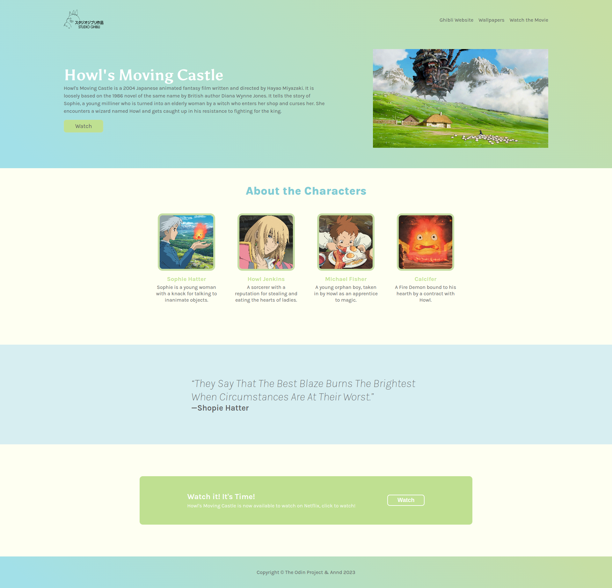

# Odin's Landing Page Project

This is a project from **The Odin Project** which consists in making a _landing page_ using **flexbox**. 

## About the project:

* Odin has given a layout to follow, however, the person can style it as they want, so I chose to style my page as a Ghibli's movie "Howl's Moving Castle" page.
* The page has an header with navigation bar with some links, the movie's summary, a picture of it, plus a button that redirects for the Netflix page, where the movie is now available to watch.
* The page also has a section to show the main characters with a short description of them.
* A quote section with a quote of the character _"Sophie"_.
* A call to action that leads the user to watch the movie on Netflix.
* And a footer section.

## Credits of resources used to build this page:
* [Images](https://www.ghibli.jp/works/howl/#frame) used.
* [Streaming](https://www.netflix.com/br-en/title/70028883#:~:text=Teenager%20Sophie%20works%20in%20her,transformed%20into%20an%20elderly%20woman.&text=Watch%20all%20you%20want.&text=This%20Oscar%20nominee%20for%20Best,Billy%20Crystal%20and%20Josh%20Hutcherson.)
* Sophie's [quote](https://screenrant.com/howls-moving-castle-memorable-quotes-ranked-studio-ghibli/#quot-it-can-39-t-be-good-for-the-table-quot) used in the quote section.
* [Description](https://howlscastle.fandom.com/wiki/Howl%27s_Moving_Castle_(novel)) of the characters.

## The result: 

